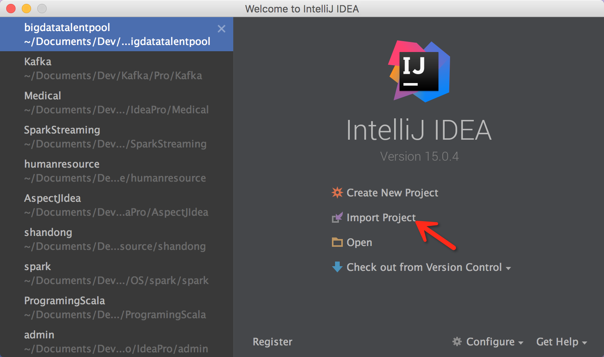
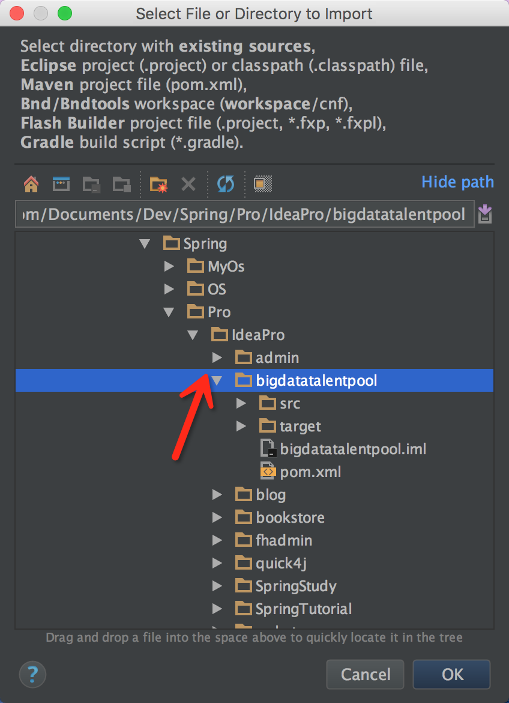
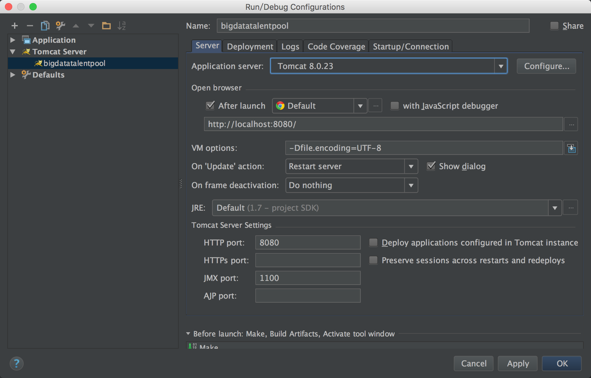
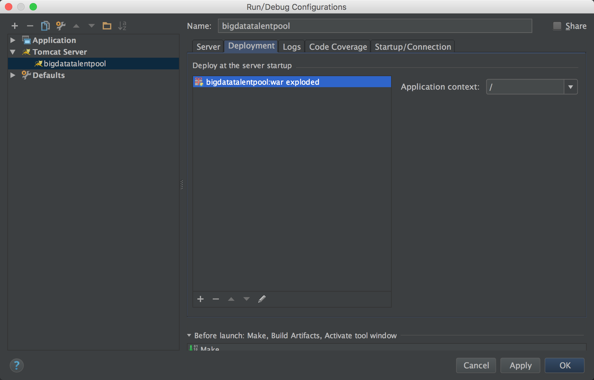
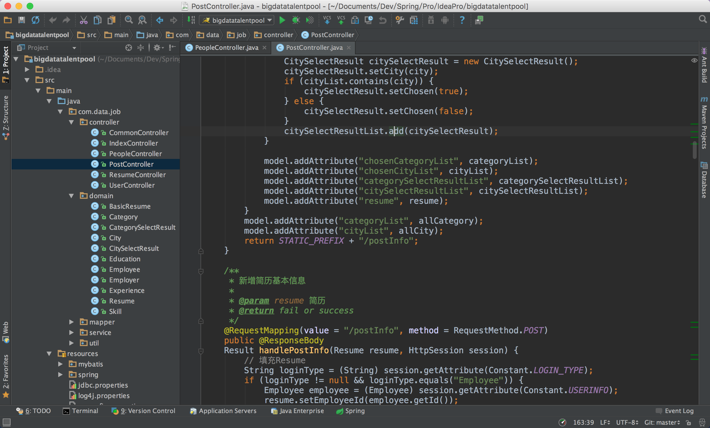

## 项目简介
本项目采用目前最流行的Spring+SpringMVC+Mybatis架构，数据库为mysql,目前已经部署至[大数据人才简历库](http://121.42.144.80:8080/bigdatatalentpool/)

## 下载项目
```
git clone git@github.com:noprom/bigdatatalentpool.git
```

## 来几张效果图


## 如何让项目跑起来
### IntelliJ Idea用户

idea 项目采用的是maven结构，打开idea，使用maven项目导入，一直next:


tomcat的配置


最终的效果

	
### Myeclipse用户
myeclipse用户的文档已经写入doc下面的pdf文档，详情请参考那个文档。

## 代码目录说明

```
|____bigdatatalentpool-idea		----- idea项目
| |____pom.xml
| |____src
| | |____main
| | | |____java
| | | | |____com
| | | | | |____data
| | | | | | |____job
| | | | | | | |____controller
| | | | | | | | |____CommonController.java
| | | | | | | | |____IndexController.java
| | | | | | | | |____PeopleController.java
| | | | | | | | |____PostController.java
| | | | | | | | |____ResumeController.java
| | | | | | | | |____UserController.java
| | | | | | | |____domain
| | | | | | | | |____BasicResume.java
| | | | | | | | |____Category.java
| | | | | | | | |____CategorySelectResult.java
| | | | | | | | |____City.java
| | | | | | | | |____CitySelectResult.java
| | | | | | | | |____Education.java
| | | | | | | | |____Employee.java
| | | | | | | | |____Employer.java
| | | | | | | | |____Experience.java
| | | | | | | | |____Resume.java
| | | | | | | | |____Skill.java
| | | | | | | |____mapper
| | | | | | | | |____CategoryMapper.java
| | | | | | | | |____CityMapper.java
| | | | | | | | |____EducationMapper.java
| | | | | | | | |____EmployeeMapper.java
| | | | | | | | |____EmployerMapper.java
| | | | | | | | |____ExperienceMapper.java
| | | | | | | | |____ResumeMapper.java
| | | | | | | | |____SkillMapper.java
| | | | | | | |____service
| | | | | | | | |____CategoryService.java
| | | | | | | | |____CityService.java
| | | | | | | | |____EducationService.java
| | | | | | | | |____EmployeeService.java
| | | | | | | | |____EmployerService.java
| | | | | | | | |____ExperienceService.java
| | | | | | | | |____impl
| | | | | | | | | |____CategoryServiceImpl.java
| | | | | | | | | |____CityServiceImpl.java
| | | | | | | | | |____EducationServiceImpl.java
| | | | | | | | | |____EmployeeServiceImpl.java
| | | | | | | | | |____EmployerServiceImpl.java
| | | | | | | | | |____ExperienceServiceImpl.java
| | | | | | | | | |____ResumeServiceImpl.java
| | | | | | | | | |____SkillServiceImpl.java
| | | | | | | | |____ResumeService.java
| | | | | | | | |____SkillService.java
| | | | | | | |____util
| | | | | | | | |____BeanUtil.java
| | | | | | | | |____config
| | | | | | | | | |____CompositeFactory.java
| | | | | | | | |____Constant.java
| | | | | | | | |____DateUtil.java
| | | | | | | | |____FileUploader.java
| | | | | | | | |____interceptor
| | | | | | | | | |____PrivilegeInterceptor.java
| | | | | | | | | |____SqlInjectInterceptor.java
| | | | | | | | |____JsonUtil.java
| | | | | | | | |____MD5.java
| | | | | | | | |____Pager.java
| | | | | | | | |____Result.java
| | | |____resources
| | | | |____jdbc.properties
| | | | |____log4j.properties
| | | | |____mybatis
| | | | | |____CategoryMapper.xml
| | | | | |____CityMapper.xml
| | | | | |____EducationMapper.xml
| | | | | |____EmployeeMapper.xml
| | | | | |____EmployerMapper.xml
| | | | | |____ExperienceMapper.xml
| | | | | |____ResumeMapper.xml
| | | | | |____SkillMapper.xml
| | | | |____spring
| | | | | |____spring-core.xml
| | | | | |____spring-mvc.xml
| | | | |____sysconfig.properties
| | | |____webapp
| | | | |____.DS_Store
| | | | |____META-INF
| | | | | |____MANIFEST.MF
| | | | |____static
| | | | | |____datajob
| | | | | | |____css
| | | | | | | |____chosen.css
| | | | | | | |____colors
| | | | | | | | |____default.css
| | | | | | | |____custom.css
| | | | | | | |____font-awesome.min.css
| | | | | | | |____jquery.datetimepicker.css
| | | | | | | |____plugins
| | | | | | | | |____toastr
| | | | | | | | | |____toastr.min.css
| | | | | | | |____style-selector.css
| | | | | | | |____style.css
| | | | | | |____fonts
| | | | | | | |____fontawesome-webfont.ttf
| | | | | | | |____fontawesome-webfont.woff
| | | | | | | |____fontawesome-webfont.woff2
| | | | | | |____images
| | | | | | | |____.DS_Store
| | | | | | | |____avatar
| | | | | | | | |____.DS_Store
| | | | | | | | |____anonymous.png
| | | | | | | | |____anonymous_big.png
| | | | | | | |____background.jpg
| | | | | | | |____chosen-sprite.png
| | | | | | | |____chosen-sprite@2x.png
| | | | | | | |____company-logo.png
| | | | | | | |____favicon.ico
| | | | | | | |____heading-bg.png
| | | | | | | |____home-slider.jpg
| | | | | | | |____logo-mobile.png
| | | | | | | |____logo.jpg
| | | | | | |____js
| | | | | | | |____bootstrap.min.js
| | | | | | | |____chosen.jquery.min.js
| | | | | | | |____custom.js
| | | | | | | |____data-nooGmapL10n.js
| | | | | | | |____hoverIntent-r7.min.js
| | | | | | | |____imagesloaded.pkgd.min.js
| | | | | | | |____isotope-2.0.0.min.js
| | | | | | | |____job-map.js
| | | | | | | |____jquery-migrate.min.js
| | | | | | | |____jquery.blockUI.min.js
| | | | | | | |____jquery.carouFredSel-6.2.1-packed.js
| | | | | | | |____jquery.cookie.js
| | | | | | | |____jquery.datetimepicker.js
| | | | | | | |____jquery.js
| | | | | | | |____jquery.parallax-1.1.3.js
| | | | | | | |____jquery.touchSwipe.min.js
| | | | | | | |____markerclusterer.min.js
| | | | | | | |____modernizr-2.7.1.min.js
| | | | | | | |____plugins
| | | | | | | | |____toastr
| | | | | | | | | |____toastr.min.js
| | | | | | | |____script.js
| | | | | | | |____style.selector.js
| | | | | | | |____superfish-1.7.4.min.js
| | | | | | | |____validation.js
| | | | | | |____plugin
| | | | | | | |____webuploader
| | | | | | | | |____image-upload
| | | | | | | | | |____bg.png
| | | | | | | | | |____expressInstall.swf
| | | | | | | | | |____icons.png
| | | | | | | | | |____icons.psd
| | | | | | | | | |____image.png
| | | | | | | | | |____index.html
| | | | | | | | | |____jquery.js
| | | | | | | | | |____progress.png
| | | | | | | | | |____progress.psd
| | | | | | | | | |____style.css
| | | | | | | | | |____success.png
| | | | | | | | | |____upload.js
| | | | | | | | |____README.md
| | | | | | | | |____Uploader.swf
| | | | | | | | |____webuploader.css
| | | | | | | | |____webuploader.js
| | | | | | | | |____webuploader.min.js
| | | | |____WEB-INF
| | | | | |____lib
| | | | | | |____commons-codec-1.9.jar
| | | | | | |____commons-fileupload-1.3.1.jar
| | | | | | |____commons-io-2.4.jar
| | | | | | |____json.jar
| | | | | | |____ueditor.jar
| | | | | |____views
| | | | | | |____job
| | | | | | | |____404.jsp
| | | | | | | |____500.jsp
| | | | | | | |____footer.jsp
| | | | | | | |____head.jsp
| | | | | | | |____header.jsp
| | | | | | | |____index.jsp
| | | | | | | |____js.jsp
| | | | | | | |____login.jsp
| | | | | | | |____modal.jsp
| | | | | | | |____people
| | | | | | | | |____people.jsp
| | | | | | | | |____peopleList.jsp
| | | | | | | |____post
| | | | | | | | |____postDetail.jsp
| | | | | | | | |____postInfo.jsp
| | | | | | | | |____postPreview.jsp
| | | | | | | |____resume
| | | | | | | | |____resume.jsp
| | | | | | | | |____resumeDetail.jsp
| | | | | | | | |____resumeList.jsp
| | | | | | | |____user
| | | | | | | | |____account.jsp
| | | | | | | | |____index.jsp
| | | | | | | | |____resume.jsp
| | | | | | | | |____resumeDetail.jsp
| | | | | |____web.xml
|____bigdatatalentpool-myeclipse			----- myeclipse 项目
| |____src					----- 源代码目录
| | |____java
| | | |____com
| | | | |____data
| | | | | |____job
| | | | | | |____controller
| | | | | | | |____CommonController.java
| | | | | | | |____IndexController.java
| | | | | | | |____PeopleController.java
| | | | | | | |____PostController.java
| | | | | | | |____ResumeController.java
| | | | | | | |____UserController.java
| | | | | | |____domain
| | | | | | | |____BasicResume.java
| | | | | | | |____Category.java
| | | | | | | |____CategorySelectResult.java
| | | | | | | |____City.java
| | | | | | | |____CitySelectResult.java
| | | | | | | |____Education.java
| | | | | | | |____Employee.java
| | | | | | | |____Employer.java
| | | | | | | |____Experience.java
| | | | | | | |____Resume.java
| | | | | | | |____Skill.java
| | | | | | |____mapper
| | | | | | | |____CategoryMapper.java
| | | | | | | |____CityMapper.java
| | | | | | | |____EducationMapper.java
| | | | | | | |____EmployeeMapper.java
| | | | | | | |____EmployerMapper.java
| | | | | | | |____ExperienceMapper.java
| | | | | | | |____ResumeMapper.java
| | | | | | | |____SkillMapper.java
| | | | | | |____service
| | | | | | | |____CategoryService.java
| | | | | | | |____CityService.java
| | | | | | | |____EducationService.java
| | | | | | | |____EmployeeService.java
| | | | | | | |____EmployerService.java
| | | | | | | |____ExperienceService.java
| | | | | | | |____impl
| | | | | | | | |____CategoryServiceImpl.java
| | | | | | | | |____CityServiceImpl.java
| | | | | | | | |____EducationServiceImpl.java
| | | | | | | | |____EmployeeServiceImpl.java
| | | | | | | | |____EmployerServiceImpl.java
| | | | | | | | |____ExperienceServiceImpl.java
| | | | | | | | |____ResumeServiceImpl.java
| | | | | | | | |____SkillServiceImpl.java
| | | | | | | |____ResumeService.java
| | | | | | | |____SkillService.java
| | | | | | |____util
| | | | | | | |____BeanUtil.java
| | | | | | | |____config
| | | | | | | | |____CompositeFactory.java
| | | | | | | |____Constant.java
| | | | | | | |____DateUtil.java
| | | | | | | |____FileUploader.java
| | | | | | | |____interceptor
| | | | | | | | |____PrivilegeInterceptor.java
| | | | | | | | |____SqlInjectInterceptor.java
| | | | | | | |____JsonUtil.java
| | | | | | | |____MD5.java
| | | | | | | |____Pager.java
| | | | | | | |____Result.java
| | |____resources
| | | |____jdbc.properties
| | | |____log4j.properties
| | | |____mybatis
| | | | |____CategoryMapper.xml
| | | | |____CityMapper.xml
| | | | |____EducationMapper.xml
| | | | |____EmployeeMapper.xml
| | | | |____EmployerMapper.xml
| | | | |____ExperienceMapper.xml
| | | | |____ResumeMapper.xml
| | | | |____SkillMapper.xml
| | | |____spring
| | | | |____spring-core.xml
| | | | |____spring-mvc.xml
| | | |____sysconfig.properties
| |____WebRoot
| | |____META-INF
| | | |____MANIFEST.MF
| | |____static
| | | |____datajob
| | | | |____css
| | | | | |____chosen.css
| | | | | |____colors
| | | | | | |____default.css
| | | | | |____custom.css
| | | | | |____font-awesome.min.css
| | | | | |____jquery.datetimepicker.css
| | | | | |____plugins
| | | | | | |____toastr
| | | | | | | |____toastr.min.css
| | | | | |____style-selector.css
| | | | | |____style.css
| | | | |____fonts
| | | | | |____fontawesome-webfont.ttf
| | | | | |____fontawesome-webfont.woff
| | | | | |____fontawesome-webfont.woff2
| | | | |____images
| | | | | |____avatar
| | | | | | |____.DS_Store
| | | | | | |____anonymous.png
| | | | | | |____anonymous_big.png
| | | | | |____background.jpg
| | | | | |____chosen-sprite.png
| | | | | |____chosen-sprite@2x.png
| | | | | |____company-logo.png
| | | | | |____favicon.ico
| | | | | |____heading-bg.png
| | | | | |____home-slider.jpg
| | | | | |____logo-mobile.png
| | | | | |____logo.jpg
| | | | |____js
| | | | | |____bootstrap.min.js
| | | | | |____chosen.jquery.min.js
| | | | | |____custom.js
| | | | | |____data-nooGmapL10n.js
| | | | | |____hoverIntent-r7.min.js
| | | | | |____imagesloaded.pkgd.min.js
| | | | | |____isotope-2.0.0.min.js
| | | | | |____job-map.js
| | | | | |____jquery-migrate.min.js
| | | | | |____jquery.blockUI.min.js
| | | | | |____jquery.carouFredSel-6.2.1-packed.js
| | | | | |____jquery.cookie.js
| | | | | |____jquery.datetimepicker.js
| | | | | |____jquery.js
| | | | | |____jquery.parallax-1.1.3.js
| | | | | |____jquery.touchSwipe.min.js
| | | | | |____markerclusterer.min.js
| | | | | |____modernizr-2.7.1.min.js
| | | | | |____plugins
| | | | | | |____toastr
| | | | | | | |____toastr.min.js
| | | | | |____script.js
| | | | | |____style.selector.js
| | | | | |____superfish-1.7.4.min.js
| | | | | |____validation.js
| | | | |____plugin
| | | | | |____.DS_Store
| | | | | |____webuploader
| | | | | | |____image-upload
| | | | | | | |____bg.png
| | | | | | | |____expressInstall.swf
| | | | | | | |____icons.png
| | | | | | | |____icons.psd
| | | | | | | |____image.png
| | | | | | | |____index.html
| | | | | | | |____jquery.js
| | | | | | | |____progress.png
| | | | | | | |____progress.psd
| | | | | | | |____style.css
| | | | | | | |____success.png
| | | | | | | |____upload.js
| | | | | | |____README.md
| | | | | | |____Uploader.swf
| | | | | | |____webuploader.css
| | | | | | |____webuploader.js
| | | | | | |____webuploader.min.js
| | |____WEB-INF
| | | |____classes
| | | | |____com
| | | | | |____data
| | | | | | |____job
| | | | | | | |____controller
| | | | | | | | |____CommonController.class
| | | | | | | | |____IndexController.class
| | | | | | | | |____PeopleController.class
| | | | | | | | |____PostController.class
| | | | | | | | |____ResumeController.class
| | | | | | | | |____UserController.class
| | | | | | | |____domain
| | | | | | | | |____BasicResume.class
| | | | | | | | |____Category.class
| | | | | | | | |____CategorySelectResult.class
| | | | | | | | |____City.class
| | | | | | | | |____CitySelectResult.class
| | | | | | | | |____Education.class
| | | | | | | | |____Employee.class
| | | | | | | | |____Employer.class
| | | | | | | | |____Experience.class
| | | | | | | | |____Resume.class
| | | | | | | | |____Skill.class
| | | | | | | |____mapper
| | | | | | | | |____CategoryMapper.class
| | | | | | | | |____CityMapper.class
| | | | | | | | |____EducationMapper.class
| | | | | | | | |____EmployeeMapper.class
| | | | | | | | |____EmployerMapper.class
| | | | | | | | |____ExperienceMapper.class
| | | | | | | | |____ResumeMapper.class
| | | | | | | | |____SkillMapper.class
| | | | | | | |____service
| | | | | | | | |____CategoryService.class
| | | | | | | | |____CityService.class
| | | | | | | | |____EducationService.class
| | | | | | | | |____EmployeeService.class
| | | | | | | | |____EmployerService.class
| | | | | | | | |____ExperienceService.class
| | | | | | | | |____impl
| | | | | | | | | |____CategoryServiceImpl.class
| | | | | | | | | |____CityServiceImpl.class
| | | | | | | | | |____EducationServiceImpl.class
| | | | | | | | | |____EmployeeServiceImpl.class
| | | | | | | | | |____EmployerServiceImpl.class
| | | | | | | | | |____ExperienceServiceImpl.class
| | | | | | | | | |____ResumeServiceImpl.class
| | | | | | | | | |____SkillServiceImpl.class
| | | | | | | | |____ResumeService.class
| | | | | | | | |____SkillService.class
| | | | | | | |____util
| | | | | | | | |____BeanUtil.class
| | | | | | | | |____config
| | | | | | | | | |____CompositeFactory.class
| | | | | | | | |____Constant.class
| | | | | | | | |____DateUtil.class
| | | | | | | | |____FileUploader.class
| | | | | | | | |____interceptor
| | | | | | | | | |____PrivilegeInterceptor.class
| | | | | | | | |____JsonUtil.class
| | | | | | | | |____MD5.class
| | | | | | | | |____Pager.class
| | | | | | | | |____Result$Status.class
| | | | | | | | |____Result.class
| | | | |____jdbc.properties
| | | | |____log4j.properties
| | | | |____mybatis
| | | | | |____CategoryMapper.xml
| | | | | |____CityMapper.xml
| | | | | |____EducationMapper.xml
| | | | | |____EmployeeMapper.xml
| | | | | |____EmployerMapper.xml
| | | | | |____ExperienceMapper.xml
| | | | | |____ResumeMapper.xml
| | | | | |____SkillMapper.xml
| | | | |____spring
| | | | | |____spring-core.xml
| | | | | |____spring-mvc.xml
| | | | |____sysconfig.properties
| | | |____lib
| | | | |____activation-1.1.jar
| | | | |____aopalliance-1.0.jar
| | | | |____aspectjweaver-1.8.4.jar
| | | | |____commons-beanutils-1.9.2.jar
| | | | |____commons-codec-1.6.jar
| | | | |____commons-codec-1.9.jar
| | | | |____commons-collections-3.2.1.jar
| | | | |____commons-configuration-1.9.jar
| | | | |____commons-fileupload-1.3.1.jar
| | | | |____commons-io-2.2.jar
| | | | |____commons-io-2.4.jar
| | | | |____commons-lang-2.4.jar
| | | | |____commons-logging-1.1.1.jar
| | | | |____commons-pool2-2.0.jar
| | | | |____druid-0.2.6.jar
| | | | |____ehcache-2.10.0.jar
| | | | |____ezmorph-1.0.6.jar
| | | | |____fastjson-1.1.41.jar
| | | | |____gson-2.3.jar
| | | | |____hamcrest-all-1.3.jar
| | | | |____httpclient-4.3.5.jar
| | | | |____httpcore-4.3.2.jar
| | | | |____jackson-annotations-2.4.2.jar
| | | | |____jackson-core-2.4.2.jar
| | | | |____jackson-core-asl-1.9.13.jar
| | | | |____jackson-databind-2.4.2.jar
| | | | |____jackson-mapper-asl-1.9.13.jar
| | | | |____jedis-2.4.2.jar
| | | | |____jms-1.1.jar
| | | | |____json-lib-2.3-jdk15.jar
| | | | |____json.jar
| | | | |____jstl-1.2.jar
| | | | |____log4j-1.2.17.jar
| | | | |____mail-1.4.7.jar
| | | | |____mina-core-2.0.8.jar
| | | | |____mybatis-3.2.4.jar
| | | | |____mybatis-spring-1.2.1.jar
| | | | |____mysql-connector-java-5.0.5.jar
| | | | |____oscache-2.4.1.jar
| | | | |____protobuf-java-2.5.0.jar
| | | | |____slf4j-api-1.7.7.jar
| | | | |____slf4j-log4j12-1.6.6.jar
| | | | |____spring-aop-4.1.4.RELEASE.jar
| | | | |____spring-aspects-4.1.4.RELEASE.jar
| | | | |____spring-beans-4.1.4.RELEASE.jar
| | | | |____spring-context-4.1.4.RELEASE.jar
| | | | |____spring-context-support-4.1.4.RELEASE.jar
| | | | |____spring-core-4.1.4.RELEASE.jar
| | | | |____spring-data-redis-1.3.0.RELEASE.jar
| | | | |____spring-expression-4.1.4.RELEASE.jar
| | | | |____spring-jdbc-4.1.4.RELEASE.jar
| | | | |____spring-tx-4.1.4.RELEASE.jar
| | | | |____spring-web-4.1.4.RELEASE.jar
| | | | |____spring-webmvc-4.1.4.RELEASE.jar
| | | | |____standard-1.1.2.jar
| | | |____views
| | | | |____job
| | | | | |____.DS_Store
| | | | | |____404.jsp
| | | | | |____500.jsp
| | | | | |____footer.jsp
| | | | | |____head.jsp
| | | | | |____header.jsp
| | | | | |____index.jsp
| | | | | |____js.jsp
| | | | | |____login.jsp
| | | | | |____modal.jsp
| | | | | |____people
| | | | | | |____people.jsp
| | | | | | |____peopleList.jsp
| | | | | |____post
| | | | | | |____postDetail.jsp
| | | | | | |____postInfo.jsp
| | | | | | |____postPreview.jsp
| | | | | |____resume
| | | | | | |____resume.jsp
| | | | | | |____resumeDetail.jsp
| | | | | | |____resumeList.jsp
| | | | | |____user
| | | | | | |____account.jsp
| | | | | | |____index.jsp
| | | | | | |____resume.jsp
| | | | | | |____resumeDetail.jsp
| | | |____web.xml
|____bigdatatalentpool.sql						----- sql文件
|____doc										----- 文档
| |____SpringMVC利用拦截器防止SQL注入_08111302_1120132046_王韬懿.pdf
| |____大数据人才简历库设计文档_08111302_1120132046_王韬懿.pdf
| |____执行sql文件说明.txt
|____README.md
```